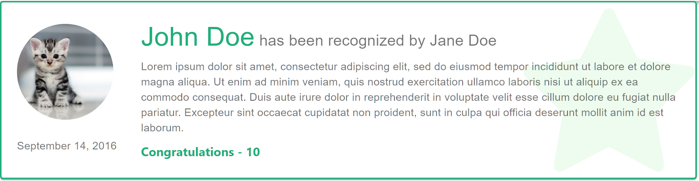

Basic Post component:




```typescript jsx static 
export default function Post(props: {recognition: Recognition}) {
  const classes = useStyles();
  const post = props.recognition;
  
  return (
    <Card className={classes.root}>
      <Box display="flex" flexDirection="row" style={{ marginTop: 8}}>
        <div>
          
          <Typography variant="body2" color="textSecondary" style={{ marginLeft: 20 }}>
              {(new Date(post.postDate)).toLocaleString('en-US', { month: 'long', day: 'numeric', year: 'numeric' })}
          </Typography>
        </div>
        <div>
          <CardContent>
            <Typography variant="h4" className={classes.themeColor} style={{ display: 'inline-block' }}>
              <Link href="#" color="inherit" style={{ textDecoration: 'none' }}>{post.empTo.firstName} {post.empTo.lastName}</Link>
            </Typography>
            <Typography variant="h6" color="textSecondary" style={{ display: 'inline-block' }}>
              &nbsp;has been recognized by&nbsp;
              <Link href="#" color="inherit" style={{ textDecoration: 'none' }}>{post.empFrom.firstName} {post.empFrom.lastName}</Link>
            </Typography>
            
            <Typography variant="body2" color="textSecondary" component="p" style={{ marginTop: 8 }}>
              {post.msg}
            </Typography>
            
            {post.tags.map((tag: any, idx: number) => {
              return (
                <ColorButton key={idx} variant="contained" color="primary" className={classes.buttons} disableElevation>
                  {tag.value}
                </ColorButton>
              )
            })}
          </CardContent>
        </div>
      </Box>
    </Card>
  );
}
```

